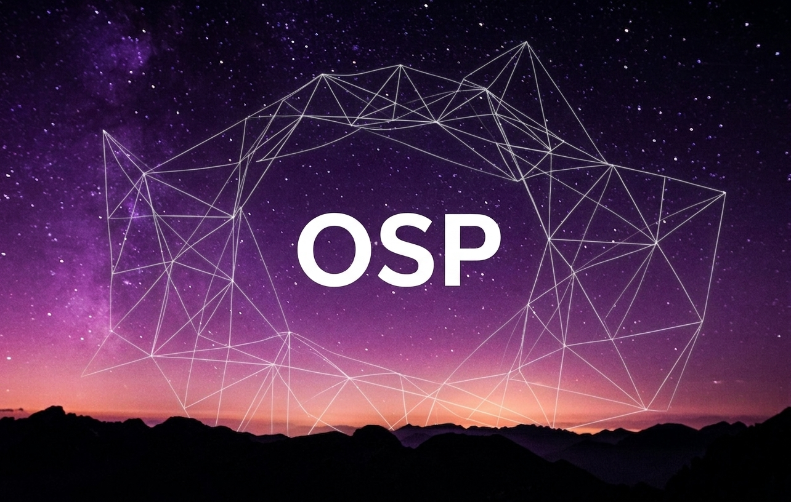

# Orange-Security-Protocol
— это интернет-протокол прикладного уровня над TCP, который обеспечивает автоматическое шифрование и упрощает взаимодействие между двумя узлами.

# Быстрое начало
Программа-пример для проверки средней скорости сети.
### Сервер
  

    public static class OSPServerTesting
    {

        public static async Task Main()
        {

            OSPServer server = new OSPServer(IPAddress.Any, 1111);
            server.Settings.MaxReceiveDataLength = (long)1024 * 1024 * 10000;

            server.Settings.MaxPingPacketsPerSecond = 5;

            server.Settings.HandshakeSegmentInterval = new OSPSegment(12, 65);
            server.Settings.HandshakeSegmentSize = new OSPSegment(200, 250);

            server.OnErrorOccured += Server_OnErrorOccured;

            server.Start(MessageHandler);

            Console.ReadLine();
        }

        private static void Server_OnErrorOccured(IPEndPoint remotePoint, Exception ex)
        {
            Console.WriteLine(ex);
        }

        private static async Task<OSPServerAnswer> MessageHandler(OSPMessageEventArgs Arguments)
        {
            OSPServerAnswer answer = new OSPServerAnswer();

            if (ToText(Arguments.Header.Description) == "SpeedTest")
            {
                if (Arguments.Data == null) { answer.Code = OSPStatusCode.BadRequest; return answer; }
                NativeBytes bytes = new NativeBytes(Arguments.Data.Length);
                answer.Data = new OSPData(bytes);
                answer.Code = OSPStatusCode.OK;
            }
            else answer.Code = OSPStatusCode.Error;
            return answer;
        }

        public static byte[] FromText(string input) => Encoding.UTF8.GetBytes(input);
        public static string ToText(ReadOnlyMemory<byte> data) => Encoding.UTF8.GetString(data.Span);
    }
### Клиент
    public static class OSPClientTesting
    {
        static Stopwatch ingressWatch = new Stopwatch();
        static long bytesToSend = (long)1024*1024*5000; // Ingress-Egress 5000 MB

  
        public static async Task ResponseProgressRead(double Progress, uint ID, ReadOnlyMemory<byte>? Data)
        {
      
      
            if (Progress == 1)
            {
                ingressWatch.Stop();
                double ingressSpeed = (bytesToSend * 8.0) / (ingressWatch.ElapsedMilliseconds * 1000.0);

                Console.WriteLine("Average Ingress Speed: " + ingressSpeed.ToString("F2", CultureInfo.InvariantCulture) + " Mbps");
            }
        }

        public static async Task Main()
        {

            OSPClient client = new OSPClient(IPAddress.Loopback, 1111);
            client.Settings.PingInvervalMilliseconds = 100;

            client.Settings.HandshakeSegmentInterval = new OSPSegment(10, 50);
            client.Settings.HandshakeSegmentSize = new OSPSegment(200, 500);
    
            client.OnResponseProgressRead = ResponseProgressRead;

            await client.Start();

            byte[] header = FromText("SpeedTest");
            NativeBytes bytes = new NativeBytes(bytesToSend); 

            Stopwatch egressSpeed = Stopwatch.StartNew();
            var response = await client.Send(bytes, header, isStreaming: true);
    
            egressSpeed.Stop();

            ingressWatch.Start();

            double mbpsEgress = (bytesToSend * 8.0) / (egressSpeed.ElapsedMilliseconds * 1000.0);

            Console.WriteLine("Average Egress Speed: " + mbpsEgress.ToString("F2", CultureInfo.InvariantCulture) + " Mbps");

            await Task.Delay(-1);
    

        }

## Основные возможности

- Быстрая генерация пары ECDSA-ключей:
  
    `var MasterKeys = OSPTools.GenerateECDSAMasterKeys();`

- Заголовки запросов:
  
    `OSPResponse response = await client.Send(FromText("Hello!"), AnyHeaderBytes);`

- Внезапная отправка данных клиенту:

    `await server.Send(FromText("Hello too!"), ConnectedIP, AnyHeaderBytes);`

- Отслеживание прогресса ответа сервера на клиенте:

    Подписываемся на событие:
  
    `client.OnResponseProgressRead = ResponseProgressRead;`

    Выводим прогресс:

       public static async Task ResponseProgressRead(double Progress, uint ID, ReadOnlyMemory<byte>? Data)
       {
            Console.WriteLine("Download Progress: {0}%", Progress * 100);
       }

  - Программное изменение скорости:
    
      # Клиент
    
       `client.Settings.DefaultEgressBitrateMbps = 200;`
    
       `client.Settings.DefaultIngressBitrateMbps = 200;`

      # Сервер
        
       `server.Settings.DefaultEgressBitrateMbps = 200;`
    
       `server.Settings.DefaultIngressBitrateMbps = 200;`

       Изменение скорости для конкретного клиента:
    
       `server.UpdateBitrateMbpsWith(IPEndPoint, EgressBitrateMbps: 200, IngressBitrateMbps: 200);`

## Безопасность и криптография

- Использование гибридного, постквантового шифрования (ML-KEM + ECDSA + ECDH + AES-GCM) с проверкой подписи и защитой от MitM.
- Шифрование заголовка и данных.
- Заполнение случайным шумом рукопожатия.
- Интервальная отправка пакетов во время рукопожатия.
- Нумерация для предотвращения использования старых пакетов.

## Зависимости

- BouncyCastle.Cryptography v2.6.2
